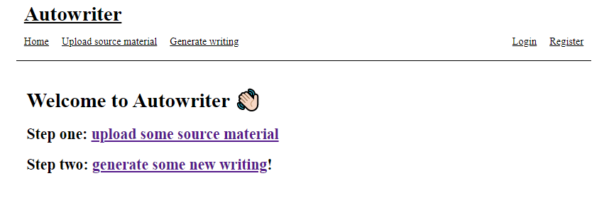

This is a .NET application that I wrote after watching [Jimmy Bogard's talk on vertical slice architecture](https://www.youtube.com/watch?v=5kOzZz2vj2o) as a way of understanding what it might look like in practice.

# Running the app
1. Ensure you have [the .NET 6 SDK installed](https://dotnet.microsoft.com/en-us/download/dotnet/6.0)
2. Clone the repository like `git clone https://github.com/un1r8okq/Autowriter.git`
3. Open your favourite terminal in the cloned repository
4. Ensure you are in the Autowriter.RazorPages directory
5. Run `dotnet run` to download dependencies, build the project, and run the kestrel web server. The app should open in your default browser automatically

# Features
* Upload source material (text)
* Generate new text from your source material
* Register with an email and password
* Authenticate with email and password

# Repository Structure

## Autowriter.RazorPages
This is an [ASP.NET Core 6 Razor Pages application](https://docs.microsoft.com/en-us/aspnet/core/razor-pages/?view=aspnetcore-6.0&tabs=visual-studio) that acts as a basic UI over my application. It handles authentication of users and presentation of the functionality.

## Autowriter.RazorPages.Tests
This is a collection of tests for Autowriter.RazorPages. It is made up of

### Autowriter.RazorPages.UnitTests
These use [xUnit](https://xunit.net/) to validate the [AutoMapper](https://automapper.org/) configuration. There isn't any domain logic in this project to test, only presentation code (which is very brittle).

### Autowriter.RazorPages.IntegrationTests
These use [an in memory test server](https://docs.microsoft.com/en-us/aspnet/core/test/integration-tests?view=aspnetcore-6.0) to check that everything is talking. Things like
* Testing that [dependency injection](https://docs.microsoft.com/en-us/aspnet/core/fundamentals/dependency-injection?view=aspnetcore-6.0) works
* Testing [Routing](https://docs.microsoft.com/en-us/aspnet/core/fundamentals/routing?view=aspnetcore-6.0)

## Autowriter.Core
This is the domain logic and storage layer for the application.

## Autowriter.Core.Tests
These use xUnit to test the core domain and storage logic of the application.
